<h1 align="left">Hi 👋!</h1>

###

<h2 align="left">About me</h2>

###

I'm a passionate cybersecurity enthusiast and currently the President of the Cybersecurity Club at the University of Utah Asia Campus. My interests include CTF challenges, ethical hacking, and exploring the intricacies of operating systems. I'm always eager to learn and collaborate on projects that enhance digital security.

###

<h2 align="left">Languages and Tools</h2>

###

  
  
  
  
  
  
  
  
  
  
  

###

<h2 align="left">Connection</h2>

###

  
  
  
  

  Personal blog : https://zwique.gitbook.io

###

<h2 align="left">Stats</h2>

###

<picture>
  <source media="(prefers-color-scheme: dark)" srcset="github-snake.svg" />
  
</picture>
